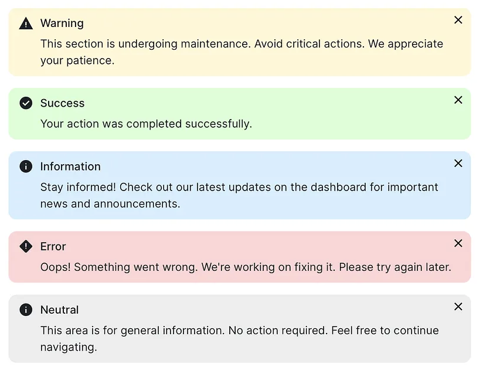

### Alert Banner

Criar um componente **Alert Banner** com o objetivo de apresentar informações importantes ao usuário de forma clara, objetiva e eficiente.

O componente deve contemplar os seguintes tipos:

- **Alerta**
- **Perigo**
- **Informação**
- **Sucesso**

### Diretrizes

- No processo criativo, buscar referências e exemplos de UI em plataformas como **Dribbble** e **Figma Community**.
- Utilizar **quatro ícones**, sendo um específico para cada tipo de alerta: Alerta, Perigo, Informação e Sucesso.
- Os banners devem possuir **variações visuais diferentes entre si**, explorando diferentes possibilidades de:
  - Layout
  - Cores
  - Hierarquia visual
  - Composição
- Apesar das variações visuais, todos os tipos devem cumprir o mesmo objetivo: **comunicar uma informação ao usuário de forma clara e eficiente**.
- O componente deve ser **adaptável de acordo com o tipo de alerta e a mensagem apresentada**.

### Props

O componente deve possuir duas props:

| Prop | Descrição |
|---|---|
| `type` | Define o tipo do alerta. |
| `message` | Define a mensagem que será exibida no banner. |

### Exemplo de uso

```jsx
<AlertBanner
  type="success"
  message="Alterações salvas com sucesso!"
/>
```

### Exemplo visual




